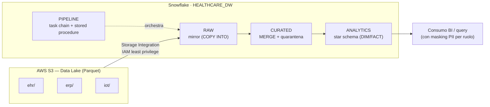

# HealthData — Data Warehouse clinico su Snowflake (RBAC & GDPR)

Data Warehouse per i dati di un ospedale su **Snowflake**: ingestione da un Data Lake
S3, modello a livelli **RAW → CURATED → ANALYTICS**, **star schema** per la BI, pipeline
**ELT idempotente** orchestrata da task chain, e un impianto di sicurezza **security-by-design**
(RBAC nativo + dynamic data masking) per la conformità **GDPR** sui dati sanitari.

> 📄 **[Leggi il report completo del progetto (PDF)](./Report_Progetto11.pdf)**
> — architettura, modello dati, DDL, sicurezza/conformità, pipeline ELT ed esecuzioni reali su Snowflake.

Progetto del **Master in Data Engineering** di ProfessionAI (corso *Data Warehousing con Snowflake*).

---

## 🎯 Obiettivo

Il caso di business: **HealthDataPro** deve modernizzare la gestione dei dati clinici di un
ospedale, oggi frammentati in sistemi legacy, centralizzandoli in un sistema **sicuro**,
**scalabile** e **conforme al GDPR**. La consegna chiedeva il solo schema dati; il progetto va
oltre, realizzando un data warehouse **end-to-end e verificabile**: ingestione, trasformazione
idempotente, modello dimensionale e sicurezza a livello di colonna, il tutto documentato con le
esecuzioni reali su un account Snowflake.

## 🏗️ Architettura

Data Lake su S3 (Parquet, organizzato per domini EHR/ERP/IoT) ingerito in Snowflake tramite
**Storage Integration** (accesso cross-account senza credenziali statiche), poi promosso lungo i
layer fino allo star schema di consumo.



| Layer / componente | Ruolo |
|--------------------|-------|
| **S3 + Storage Integration** | Data Lake Parquet; accesso cross-account via IAM role assumibile (no chiavi statiche) |
| **RAW** | Tabelle mirror caricate con `COPY INTO` fail-fast |
| **CURATED** | Standardizzazione, PK/FK *informational*, **quarantena** dei record orfani, popolamento via `MERGE` |
| **ANALYTICS** | **Star schema** (`DIM_*`, `FACT_*`, bridge diagnosi) per la BI |
| **PIPELINE** | Schema tecnico: stored procedure + **task chain** di orchestrazione |

## ⚙️ Pipeline ELT (idempotente)

Flusso unico, eseguito solo da una **task chain** che invoca tre stored procedure
(`EXECUTE AS OWNER`), pensate per essere **rieseguibili senza effetti collaterali**:

1. **`sp_load_raw`** — `COPY INTO` dei mirror RAW da S3, `ON_ERROR = ABORT_STATEMENT` (fail-fast).
2. **`sp_transform_curated`** — popola CURATED **solo via `MERGE`** su business key con dedup
   deterministica (`QUALIFY ROW_NUMBER` su fingerprint), isolando i record con chiavi nulle o
   riferimenti orfani nelle tabelle **`*_QUARANTENA`**.
3. **`sp_publish_analytics`** — pubblica DIM/FACT dello star schema, sempre via `MERGE` idempotente.

Orchestrazione con **task** in catena (`AFTER`), schedulati alle 02:00 Europe/Rome; warehouse
dedicati per fase (`WH_INGEST`, `WH_OPERATIONS`, `WH_ANALYTICS`).

## 🔐 Sicurezza e conformità (GDPR)

La sicurezza è progettata **insieme** al modello dati:

- **RBAC nativo** con 3 ruoli e gerarchia: `ROLE_DATA_ENGINEER` (ingestione/trasformazione),
  `ROLE_DATA_ANALYST` (consumo su ANALYTICS), `ROLE_COMPLIANCE_OFFICER` (audit, eredita l'analista).
- **Least privilege per layer**: scrittura solo ai ruoli tecnici; gli analisti non vedono mai il
  layer `RAW` ricco di PII; grant su tabelle presenti **e future**.
- **Dynamic Data Masking** sulle PII residue di `DIM_PAZIENTE` (`CITTA`, `DATA_NASCITA`): l'analista
  vede dati oscurati (`*** MASKED ***`, data sentinel `1900-01-01`), il compliance officer i dati in chiaro.
- **Privacy by design**: gli identificatori diretti (nome, codice fiscale, contatti) sono
  strutturalmente esclusi dal layer di consumo.

## 💾 Dati

Dataset **interamente sintetico** (nessun dato reale → nessun rischio privacy in sviluppo),
generato con la libreria **SDV (Synthetic Data Vault)** tramite un generatore dedicato:
[healthdata-synthetic-generator](https://github.com/fedevita/healthdata-synthetic-generator).
Tre domini — **EHR** (pazienti, ricoveri, diagnosi), **ERP** (reparti, personale, assegnazioni),
**IoT** (dispositivi, parametri vitali) — con integrità referenziale tra le entità.

## 🛠️ Stack

`Snowflake` · `SQL` · `Snowflake Tasks & Stored Procedures` · `Storage Integration` ·
`AWS S3 / IAM` · `Parquet` · `Dynamic Data Masking` · `RBAC` · `Typst`

## 📄 Il report

Il deliverable del progetto è il **report tecnico** in [`Report_Progetto11.pdf`](./Report_Progetto11.pdf):
documenta architettura, dizionario dati, DDL completo (RAW/CURATED/ANALYTICS), impianto RBAC e
masking, pipeline ELT e validazione analitica, con gli screenshot delle esecuzioni su Snowflake.

Il report è scritto in [Typst](https://typst.app/) (sorgenti in [`src/`](./src)) e si rigenera con:

```powershell
.\build.ps1
```

> Nota: gli ARN e gli identificatori di account/utente nel report usano valori fittizi
> (es. Account ID AWS `123456789012`, placeholder per i valori della Storage Integration).
